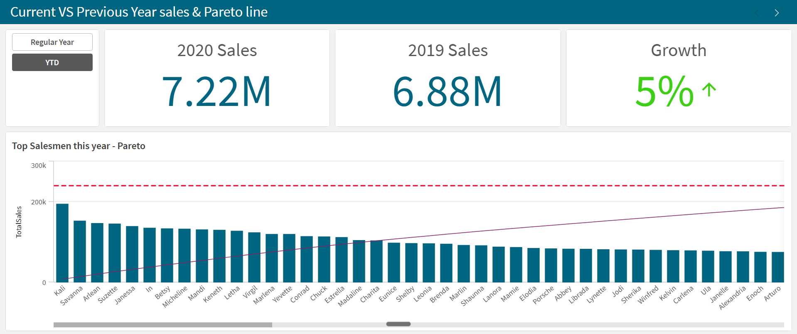
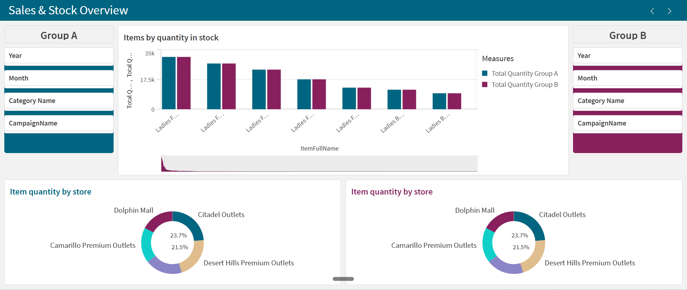
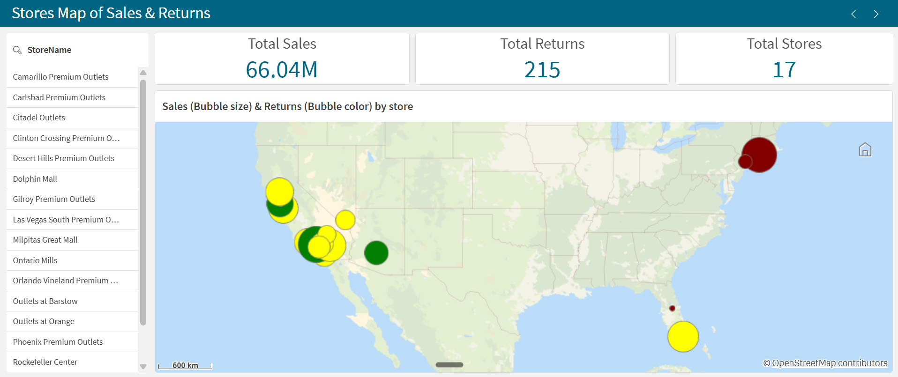
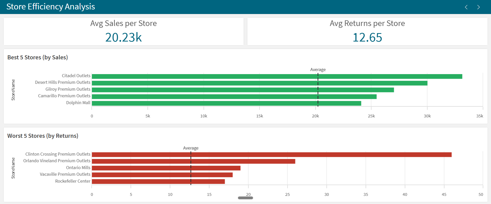
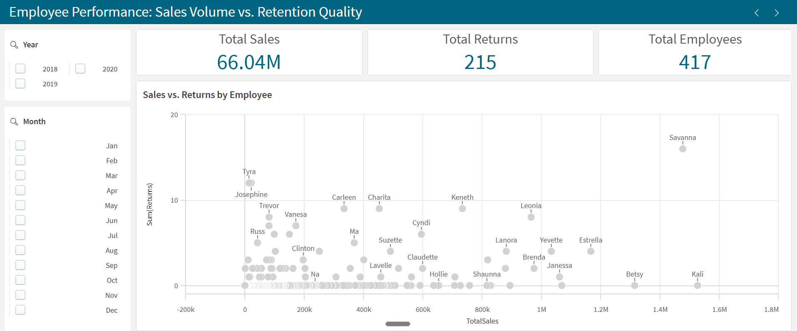
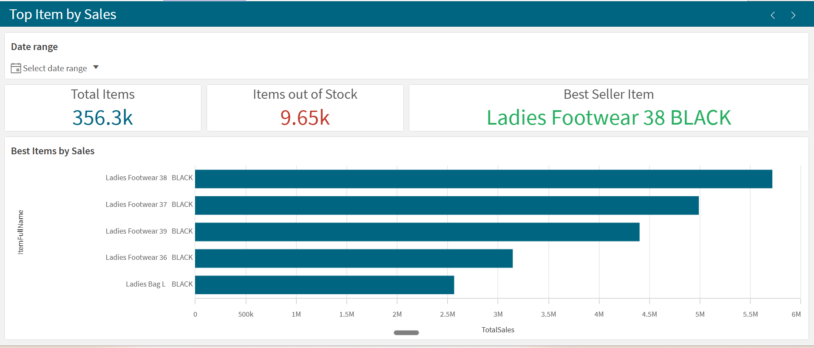

## 📊 Project Dashboards & Insights

This Qlik Sense application provides a comprehensive analysis of sales, inventory, and employee performance. Below are the key analytical views:

| Current vs. Previous Year | Sales & Stock Overview |
|:---:|:---:|
|  |  |
| *Comparison of year-over-year performance, highlighting growth trends and KPIs.* | *Analysis of inventory levels vs. sales volume across different product groups.* |

| Stores Map: Sales & Returns | Store Efficiency Analysis |
|:---:|:---:|
|  |  |
| *Geospatial visualization of sales distribution and return rates by location.* | *Deep dive into store performance metrics and operational efficiency.* |

| Employee Performance | Top Item by Sales |
|:---:|:---:|
|  |  |
| *Scatter plot analysis of sales volume vs. retention and employee KPIs.* | *Identification of best-selling products and stock-out risks.* |

---

## 🛠️ Technical Highlights
*   **Dynamic KPIs:** Built with advanced **Set Analysis** to handle YOY comparisons and growth metrics.
*   **Geospatial Analysis:** Integrated maps to identify regional sales trends and return hot-spots.
*   **Operational Tracking:** Correlating stock levels with sales performance to optimize inventory management.
*   **Data Modeling:** Optimized associative model to handle multi-dimensional analysis across stores, products, and employees.
